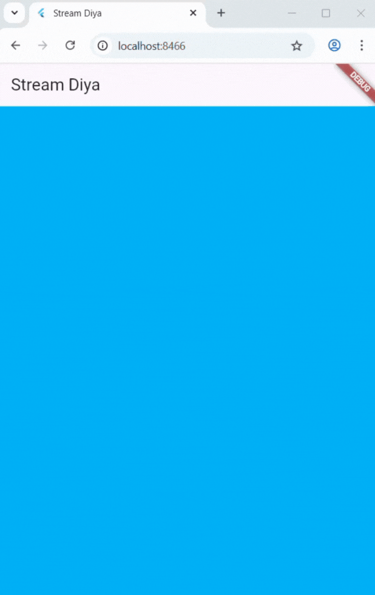

Soal no 3
1. Fungsi yield* adalah digunakan di dalam fungsi generator asinkron. Fungsinya adalah untuk mendelegasikan atau meneruskan event dari stream internal ke stream eksternal. Pada kode ini, yield* mengambil seluruh aliran data yang dihasilkan oleh Stream.periodic dan menjadikannya sebagai bagian dari aliran data getColors(). Setiap event (warna) yang dipancarkan oleh Stream.periodic akan secara otomatis dipancarkan juga oleh getColors().
2. Perintah tersebut membuat sebuah stream yang akan memancarkan satu warna baru dari list colors (secara berurutan dan berulang) setiap satu detik.

Soal no 5
1. Keduanya digunakan untuk memproses data dari stream, tetapi cara kerjanya berbeda. .listen() mengembalikan objek StreamSubscription. await for secara otomatis menangani ini saat loop berakhir.

Soal no 6
1. Maksud Kode Langkah 8 adalah untuk langkah persiapan saat widget pertama kali dimuat.Sedangkan langkah 10 adalah langkah pemicu (trigger).

Soal no 7
1. Rangkaian langkah ini bertujuan untuk mendemonstrasikan penanganan error (error handling) dalam Stream.

Soal no 8
1. Langkah 1 sampai 3 bertujuan untuk mengubah data yang mengalir di dalam strean sebelum data tersebut sampai ke UI.

Soal no 9
1. Kode Langkah 2 adalah untuk menyimpan referensi ke subscription yang sedang berjalan. Maksud Kode Langkah 6 adalah untuk mencegah kebocoran memori (memory leak). Maksud Kode Langkah 8 adalah untuk mencegah error (StateError), setelah kita menekan tombol 'Stop Subscription', StreamController akan ditutup.

Soal no 10
1. Error ini terjadi karena StreamController (dan stream yang dihasilkannya) secara default adalah Single-Subscription Stream.

Soal no 11
1. Karena di Langkah 4 kita telah mengubah stream menjadi Broadcast Stream menggunakan .asBroadcastStream().

Soal no12
1. Maksud dari Langkah no 3 adalah untuk menciptakan dan mengembalikan sebuah aliran data (Stream). Dan langkah 7 adalah "konsumen" data, streamBuilder adalah widget Flutter yang secara otomatis "berlangganan" (listen) ke sebuah stream (yaitu numberStream yang kita berikan).

Soal no 13
1. Praktikum ini mengenalkan Pola BLoC, yaitu cara memisahkan logika bisnis dari tampilan biar kodenya lebih rapi, mudah dites, dan mudah dirawat. Logika ada di random_bloc.dart, sementara UI-nya ada di random_screen.dart. BLoC hanya mengatur alur data: UI akan mengirim event lewat sink ketika tombol ditekan, dan BLoC akan mengirim balik angka acak lewat stream untuk ditampilkan di layar. Jadi UI hanya menerima dan menampilkan, sementara BLoC yang melakukan prosesnya.